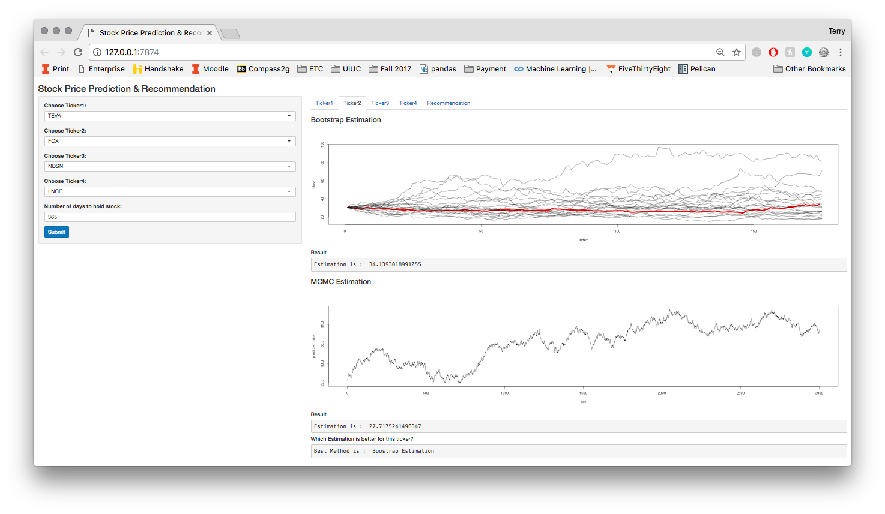
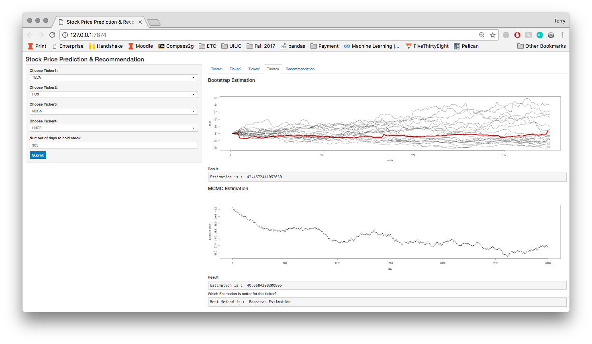
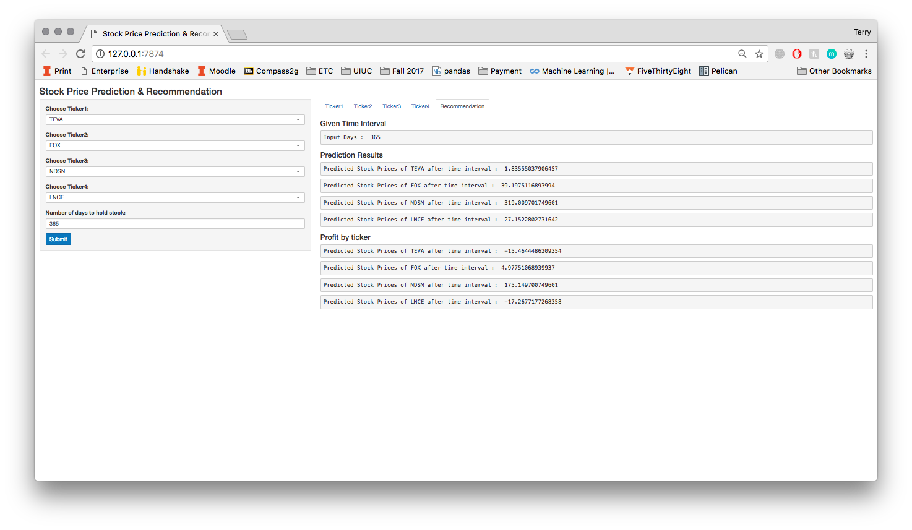

```{r, echo = FALSE, message = FALSE, warning = FALSE}

# I had to add this function uphere so that we can use function to generate required plots :D

# Function that returns the list of tickers
library(rvest)
library(magrittr)
library(BatchGetSymbols)
library(jmuOutlier)

get_valid_ticker = function() {
  most_advanced_stock_url = read_html("https://finance.yahoo.com/gainers")
  most_advanced_stock_url %>%
    html_node("#scr-res-table > table") %>%
    html_table(fill = TRUE) -> most_advanced
  most_advanced_symbol = most_advanced$Symbol # Get the list of tickers
  return(most_advanced_symbol)
}

# Function that returns the list of closing price of given tickers upto today
close_price = function(ticker) {
  first.date <- Sys.Date()-250
  last.date <- Sys.Date()
  l.out <- BatchGetSymbols(tickers = ticker,
                           first.date = first.date,
                           last.date = last.date)
  stock.data <- l.out$df.tickers 
  close <- stock.data$price.close
  return(close)
}

# Function that returns the best fitted distribution that logarithm of variance in changes
# of given stock price as a string.
variance_distribution_finder = function(close) {
  s1 <- close[2:length(close)]
  s0 <- close[1:length(close)-1]
  bs.val <- log(s1/s0)
  hist(bs.val, freq = F, breaks = 40, main = "Histogram of logarithm of vairance in stock prices")
  sd = sd(bs.val)
  curve(dnorm(x, mean=0, sd=sd), add=TRUE, col = 'red')
  curve(dcauchy(x, location = 0, scale = sd), add=TRUE, col = 'blue')
  curve(dlaplace(x, mean=0, sd = sd), add=TRUE, col = 'green')
  legend('left', 'top', c("Normal","Cauchy", "Laplace"), lwd=c(2.5,2.5,2.5),col = c('red','blue','green'))
  
  p.norm.val <- p.cauch.val <- p.laplace.val <- numeric(length(bs.val))
  for(i in 1:length(bs.val)){
    #we don't have to use the statistic. We can use bias or something else
    p.norm.val[i] <- ks.test(bs.val[-i], 'pnorm', sd=sd)$statistic
    p.cauch.val[i] <- ks.test(bs.val[-i], 'pcauchy', scale=sd)$statistic
    p.laplace.val[i] <- ks.test(bs.val[-i], 'plaplace',sd=sd)$statistic
  }
  #lower number is better
  mod.vals <- c(mean(p.norm.val), mean(p.cauch.val), mean(p.laplace.val))
  
  val.min <- which(mod.vals == min(mod.vals))
  if(val.min == 1){best.mod = 'normal'
  }else if(val.min == 2){best.mod = 'cauchy'
  }else if(val.min == 3){best.mod = 'laplace'
  }else{stop('Incorrect value for val.min')}
  
  return(best.mod)
}

# Function that returns size n of random numer from laplace distribution
rlaplace1 = function(n,a,b){
  u = runif(n)
  for(i in 1:n){
    if(u[i] <= 0.5){
      X = a+b*log(2*u)
    } else{
      X = a-b*log(2*(1-u))
    }
  }
  X
}

# Function that returns size n of random numer from cauchy distribution
rcauchy1=function(n,a,b){
  result=numeric(n)
  for (i in 1:n){
    u=runif(1000)
    x=tan(pi*(u-0.5))
    result[i]=a+b*mean(x)
  }
  return(result)
}

# Function that returns size n of random numer from normal distribution
rnorm1=function(n,a,b){
  normal_sample=integer(0)
  for (i in 1:n){
    u=runif(1)
    v=runif(1)
    z=sqrt(-2*log(u))*cos(2*pi*v)
    normal_sample=c(normal_sample,z)
  }
  return (a+b*normal_sample)
}

# Functions that returns the estimated variance of given closing prices using Bootstrap resampling
bootstrap_avg_var_finder = function(close) {
  s1 <- close[2:length(close)]
  s0 <- close[1:length(close)-1]
  bs.val <- log(s1/s0)
  n = length(bs.val)
  B = 10000
  Tboot = numeric(B)
  for(i in 1:B) {
    bootstrap_price_var = sample(bs.val, n, replace= TRUE)
    Tboot[i] = mean(bootstrap_price_var)
  }
  estimated_price_var = mean(Tboot)
  return(abs(estimated_price_var))
}

# Function that simulates stock price prediction by applying Black-Scholes model
# and returns the estimated stock prices after given time `t` and the list of changes in prices
stock_prediction = function(s0, t, v, dist) {
  trace = numeric(t+1)
  trace[1] = s0
  if(dist == "normal") {
    for(i in 1:t) {
      s0 = s0 * exp(rnorm1(1, 0, sqrt(v)))
      trace[i+1] = s0
    }
  }
  else if(dist == "cauchy") {
    for(i in 1:t) {
      s0 = s0 * exp(rcauchy1(1, 0, sqrt(v)))
      trace[i+1] = s0  
    }
  }
  else if(dist == "laplace") {
    for(i in 1:t) {
      s0 = s0 * exp(rlaplace1(1, 0, sqrt(v)))
      trace[i+1] = s0
    }
  }
  return(list(s0, trace))
}

bootstrap_plot = function(ticker) {

  close = close_price(ticker)
  
  dist = variance_distribution_finder(close)
  
  var = bootstrap_avg_var_finder(close)
  
  simNum = 20
  
  rowNum = length(close)
  
  estimate_final = numeric(simNum)
  
  prediction = matrix(0, nrow = rowNum + 1, ncol = simNum)
  
  for(i in 1:simNum) {
    
    trial = stock_prediction(close[1], length(close), var, dist)
    
    estimate_final[i] = trial[[1]]
    
    prediction[, i] =  trial[[2]]
    
  }
  
  plot(close, type = 'l', col = 'red', lwd = 5, ylim = c(min(prediction), max(prediction)))
  for(i in 1:simNum) {
    lines(prediction[, i])
  }

}


# Function that simulates stock price prediction by applying Black-Scholes model
# and returns the estimated changes of stock prices after given time `t` 

mcmc_algorithm = function(x0,N, sd, dist){
  x=numeric(N)
  x[1]=mean(bs.val)
  u=runif(N)
  k=0 
  if (dist=="laplace"){
    for(i in 2:N){
      y=rnorm(1,x[i-1],sd)
      if(u[i]<=(dlaplace(y,0,sd)/dlaplace(x[i-1],0,sd)))
        x[i]=y else{
          x[i]=x[i-1]
          k=k+1
        }
    }
    return(mean(x))
  } else if (dist=="normal"){
    for (i in 2:N){
      y=rcauchy(1,x[i-1],sd)
      ratio=dnorm(y,mean=0,sd=sd)/dnorm(x[i-1],mean=0,sd=sd)
      accept=u[i]<=ratio
      x[i]=y*accept+x[i-1]*(1-accept)
      k=k+accept
    }
    return(mean(x))
  } else if (dist=="cauchy"){
    
    for(i in 2:N){
      y=rnorm(1,x[i-1],sd)
      if(u[i]<=((dcauchy(y,location=0,scale=sd)*dnorm(x[i-1], y, sd))/(dcauchy(x[i-1],location=0,scale=sd) * dnorm(y, x[i-1], sd))))
        x[i]=y else{
          x[i]=x[i-1]
          k=k+1
        }
      return(mean(x))
    }
  }
}

## Function that simulates stock price prediction by applying Black-Scholes model
# and returns the estimated stock prices after given time `t` 

price_prediction = function(close) {
  t = length(bs.val)
  y1=replicate(t,{mcmc_algorithm (x0,N, sd, dist)})
  pred=numeric(t)
  pred[1]=close[1]
  for(i in 2:t) {
    pred[i]=pred[i-1]*exp(y1)[i-1]
  }
  return(pred)
}
```


\newpage

#Introduction

Our group wanted to find a way to chose the most profitable stock out of a set of stocks over a chosen time period. To do this, we first had to find a model that pertained to stock prices. After research we found that the Black-Scholes model would work well for what we are trying to do. This model, seen below, assumes that the log of a stock's closing price at time $t$ divided by the stock's closing price on the day before ($t-1$) is distributed normally with a mean centered at $0$ and a standard deviation of $v$. \[\log(S(t))/S(t-1)) \sim Normal(0,v),\]  
After additional research we decided on that the log return of stocks could potentially follow distributions other than normal; we considered a Cauchy distribution, which would fit better to stock returns that were more volatile because of the heavier tails, and a Laplace distribution, which is much more concentrated in the center than the other two distributions. All three distributions were centered around $0$ and used $v$, which we set as each stock's sample standard deviation from that stock's historical data that we were using. The company 3M's stock returns returns from more than 150 days trading can be seen in the histogram below. The mentioned distributions are overlayed to give a sense of what has just been discussed.

```{r include=FALSE}
library(rvest)
library(magrittr)
library(BatchGetSymbols)

first.date <- Sys.Date()-250 #can adjust based on how much data we want
last.date <- Sys.Date()

tickers <- 'NYSE:MMM' #one stock to save on computation time

l.out <- BatchGetSymbols(tickers = tickers,
                         first.date = first.date,
                         last.date = last.date)
stock.data <- l.out$df.tickers #if tickers is list then ['stock we want'] to subset

close <- stock.data$price.close
```


```{r echo=FALSE, message=FALSE, fig.align='center'}
#install.packages('jmuOutlier')
library(jmuOutlier) # for the laplace distribution
close <- stock.data$price.close
s1 <- close[2:length(close)]
s0 <- close[1:length(close)-1]
bs.val <- log(s1/s0)
hist(bs.val, freq = F, breaks = 40, main = 'Stock Returns From 3M', xlab = 'Stock Returns')
sd = sd(bs.val)
curve(dnorm(x, mean=0, sd=sd), lwd = 2.5, add=TRUE, col = 'tomato2')
curve(dcauchy(x, location = 0, scale = sd),lwd = 2.5, add=TRUE, col = 'slateblue2')
curve(dlaplace(x, mean=0, sd=sd), add=TRUE,lwd = 2.5, col = 'springgreen')
legend('left', 'top', c("Normal","Cauchy", "Laplace"), lwd=c(2.5,2.5,2.5),col = c('tomato2','slateblue2','springgreen'))
```

Whatever distribution fits closest to the data, as determined by a statistical method known as Jackknife, will then be used for the stock's future closing price prediction. To predict the future stock prices, two different statistical methods were used. These methods, which will be discussed thoroughly in the Methods section of this report, were the Bootstrap Re-sampling method and Markov Chain Monte Carlo method. All of this statistical computing was then combined into a R Shiny application which will be highlighted in the Results section. The application gives an user-friendly way to answer the question our team set out to find at the beginning of this project. The user will be able to select from a list of stocks, see the projected prices after a time period of their choosing, and ultimately find the most profitable stock based on their stock selection.

# Description of data and sources of data
The data required for the Black-Scholes model a stock's closing price. To obtain this, we scraped a set of stock tickers off of the Yahoo Finance web page (Lines #2-#9)[^footnote1].Using the obtained tickers, in conjunction with the R package 'BatchGetSymbols',  data for each stock is obtained. This data contains information for each stock including closing price, opening price, volume, and other variables for the last 174 trading days. We then subset this to only include the relevant variable, closing price. The final dataset that we will be working with contains 174 observations of the closing price for each stock ticker from the list of stock tickers.

[^footnote1]: The line numbers throughout this report are in reference to numbered lines of code in the Project Code section in the Appendix

#Methods

## Jackknife (Variance distribution)

```{r include=FALSE}
  s1 <- close[2:length(close)]
  s0 <- close[1:length(close)-1]
  bs.val <- log(s1/s0)
  p.norm.val <- p.cauch.val <- p.laplace.val <- numeric(length(bs.val))
  for(i in 1:length(bs.val)){
    #we don't have to use the statistic. We can use bias or something else
    p.norm.val[i] <- ks.test(bs.val[-i], 'pnorm', sd=sd)$statistic
    p.cauch.val[i] <- ks.test(bs.val[-i], 'pcauchy', scale=sd)$statistic
    p.laplace.val[i] <- ks.test(bs.val[-i], 'plaplace',sd=sd)$statistic
  }
  #lower number is better
  mod.vals <- c(mean(p.norm.val), mean(p.cauch.val), mean(p.laplace.val))
  
  val.min <- which(mod.vals == min(mod.vals))
  if(val.min == 1){best.mod = 'normal'
  }else if(val.min == 2){best.mod = 'cauchy'
  }else if(val.min == 3){best.mod = 'laplace'
  }else{stop('Incorrect value for val.min')}
```

As mentioned in the Introduction, we are using the Black-Scholes model but also considering the fact that log return of stocks could follow a distribution other than normal better. Looking at the figure in the introduction, it might seem that the stock returns follow a Laplace distribution more than Cauchy or Normal, but we need to be able to determine this in a way that is not merely visual. To determine the distribution that fits the best numerically, we will use the jackknife method. 

The jackknife method essentially removes one observation from `bs.val`[^footnote2] and applies the `bs.val` vector (missing one observation) to the `ks.test` function (Lines #37-#41). The `ks.test` function applies the Kolmogorov-Smirnov (K-S) test which is a goodness of fit test to compare a sample with a probability distribution function. The `bs.val` vector, the sample, is applied to three different K-S tests, one for each of the three distributions that we are comparing the sample to. The statistic for each of the tests is stored and this process is repeated, removing a different observation from `bs.val` and storing the value of the test statistic until each observation of `bs.val` has been removed once.

The mean of each of the stored statistics is then compared to the other distributions' mean statistics (Lines #43-#49). The one with the lowest mean is then chosen; for the K-S test, a smaller value from the statistic means that that the sample fits closer to the reference probability distribution function. The best fitting distribution will then be used in the methods below for prediction. Using the company 3M as an example, the mean statistic after applying for Normal distribution would be `r round(mean(p.norm.val),4)`, the mean statistic for the Cauchy distribution would be `r round(mean(p.cauch.val),4)`, the mean statistic for the Laplace distribution would be `r round(mean(p.laplace.val),4)`, so the distribution that was chosen would be the `r best.mod` distribution. So we can see that our initial guess that the stock best follows a Laplace distribution was correct, but the method that we used was based on statistics, and a stock's distribution might not always be so obvious.

Using the method above, instead of simply taking applying the full `bs.val` vector and applying it once the all three K-S tests is preferred because it reduces the possibility of a few observations swaying the results of the test greatly. Therefore the result is validated beyond what the comparison one just one test would do.


[^footnote2]: bs.val is the set of logarithmic stock returns obtained from applying the Black-Scholes formula to each stock's closing price data


## Random Number Generators (Normal & Cauchy & Laplace)
As explained above, our project first find the best-fitted distribution which the variance of stock prices follow. In order to apply the Black-Scholes model, we needed to create a Random Number Genearator for three distributions mentioned above : Normal Distribution, Cauchy Distribution and Laplace Distribution. 


To generate a normally distributed random number, we applied transformation methods[^footnote3] by creating two random uniform distributed numers `u` and `v` and calculated the expected normally distributed number. (Lines #82-#84). Then,we updated generated random normal distributed number to follow normal distribution with the given mean and variance. (Lines #87)


Similarly, to generate a random number with cauchy distribution, we applied transformation method with the formula $x = tan(\pi(y - \frac{1}{2}))$ where $y$ is a random uniformly distributed number (Line #70-#74).


Conversely, we applied inverse transformation method to generate the laplace distribution random variables. We know that the laplace distribution has a probability density function of $\frac{1}{2}e^{-|u|}$ where $u$ is random uniform distribution random variables. Hence, we estimate the inverse of the pdf (Line #58-#62) and generate random laplace distribution random variable from uniform distributed random variable.

[^footnote3]: $Z = \sqrt{-2log(U)}cos(2\pi V) \sim Normal(0,1),\ \ \  U,V \sim Unif(0,1)$ 


## Bootstrap (Average Variance & Prediction)
In order to simulate the prediction of stock prices, we needed how the given stock's prices varies. With the jackknife method explained above, we figured out what distribution does the logarithm of changes in the stock's prices follow. Then, we applied bootstrap resampling on the changes in the stock's prices to estimate the average of those changes which will be the variance of stock's prices in our case.

Hence, we first calculate the variance of given close price of the stock (Line #92-#94). Then, we perform bootstrap resampling by sampling from the estimated variance values 10,000 times and calculate the mean of all resampled to get the average variance of the stock price (Line #98-#101).

From the estimated variance of the stock and the best fitted distribution from jackknife method, we created the first prediction simulation function. The first simulation function takes four parameters : `s0` - *Initial stock price*, `t` - *Time interval*, `v` - *Variance*, `dist` - *The best fitted distribution*, and returns the stock price from the `s0` after `t` days. The function is mainly about how Black-Scholes model computes the stock price with the given distribution and the variance. Hence, the function has three different parts according to the parameter `dist`. 

For example, if `dist` is "normal", then the function generates random number that follows normal distribution with variance `v` using Random Number Generator (RNG) explained above and estimates next day's stock price with by multiplying `s0` and exponential of generated random number. The function updates `s0` during iteration and each updated values will be stored in `trace` array at each index so that we can plot the changes easily. 

As a result, the below graph is 20 simulations and actual stock prices change in red color of one ticker.
```{r, echo = FALSE, warning = FALSE, error = FALSE, message = FALSE, include = FALSE}
valid = get_valid_ticker()
ticker = 'NYSE:MMM'
close = close_price(ticker)
dist = variance_distribution_finder(close)
var = bootstrap_avg_var_finder(close)
```

```{r, echo = FALSE, warning = FALSE, error = FALSE, message = FALSE}
set.seed(1548)
simNum = 20
rowNum = length(close)
prediction = matrix(0, nrow = rowNum + 1, ncol = simNum)
for(i in 1:simNum) {
  trial = stock_prediction(close[1], length(close), var, dist)
  prediction[, i] =  trial[[2]]
}
plot(close, type = 'l', col = 'red', main='Simulation of Stock Prices Change', lwd = 5, ylim = c(min(prediction), max(prediction)))
for(i in 1:simNum) {
  lines(prediction[, i])
}
print(paste("Actual Stock Price : ", close[length(close)]))
print(paste("Estimated Stock Price : ", mean(prediction[rowNum+1,])))
```


## MCMC simulation 
In order to simulate the prediction of stock prices, we needed how the given stock's prices varies. With the jackknife method explained above, we figure out what distribution does the logarithm of changes in the stock's prices follow. Then, we apply Markov Chain Monte Carlo to stimulate changes of stock price. The method we use for conducting MCMC is Metropolis-Hasting Algorithm. 


If `dist` - *The best fitted distribution* is normal, the Markov Chain Monte Carlo uses normal distribution as proposal distribution and generate changes in the stock's prices that follow normal distribution. Similarly, other distribution will be used if the variance follows other distribution such as Cauchy and Laplace.


We begin the Markov Chain Monte Carlo at value `x0`, which is the mean of logarithmn of actual changes in prices. To reduce variance of generated number, we replace standard deviation with the standard deviation of logarithmn of actual changes in prices. Also we realize the variance of generated number will get larger as we generate longer chain. For actual changes in the stock's prices, the variance is quite small. Therefore, we generate a chain with only length of `N` and take the mean of it. We sort the means in variable `y1` and repeat the same process for 172 times because there are 173 observations of actual stock price. In the function, We can change the begining value, length of the chain and numbers of replication to meet needs of different prediction.


Since generated results are logarithmn of stock changes, we multiply the exponential of stimulated changes in stock to the first observation of actual stock price to stimulate next day's predicted price. (Line #228-#230) As a result, the below graph is 20 simulations and actual stock prices change in red color of one ticker.


From the graph, we can see logarithmn changes generated from MCMC will have larger variance as length of chain increase, which can be an obstacle for prediction. For prediction purpose, it is suggested to choose a smaller number of `N` if a stock has actual prices that are highly varied. 

```{r, echo = FALSE, warning = FALSE, error = FALSE, message = FALSE, include = FALSE}
N=10
s1 = close[2:length(close)]
s0 = close[1:length(close)-1]
bs.val = log(s1/s0)
sd = sd(bs.val)
x0=mean(bs.val)
dist = variance_distribution_finder(close)
```

```{r, echo = FALSE, warning = FALSE, error = FALSE, message = FALSE}
set.seed(1140)
prediction_plot=function(close,ntraits) {
  traits=replicate(ntraits, {price_prediction(close)})
  plot(close, type = 'l', col = 'red', lwd = 5)
  for(i in 1:ntraits) {
    lines(traits[, i])
  }
  print(paste("Actual Stock Price : ", close[length(close)]))
  print(paste("Estimated Stock Price : ", mean(tail(traits,ntraits))))
}
prediction_plot(close,20)
```


## Additional Method (Bayesian Gibbs Sampling Method)
This method will be divided into two parts.

During the first part, we are applying the exponential moving average which finds the average stock prices for 5 and 10 days respectively. Besides, we categorize each 174 trading days from Monday to Friday (eliminating holidays) as well as utilize an 'if else' statement to determine if this goes stock up or down in that certain day (Line #138-#142). In addition, by creating a new variable EMACross, we are able to differentiate between the faster EMA and the slower EMA easily which we should enter long when faster EMA crosses above slower EMA. However, since there are missing observations for the first 9 observations when calculating EMA 10 days, we remove the first 10 stock closing prices. Then, by applying Naive Bayes, there is priori probability of either up or down as well as conditional probability given Monday to Friday. As a result, for example, the stock "SEMG" is most likely to increase on Thursday and decrease on Wednesday. (Line #144-#150)

```{r echo=FALSE, message=FALSE, warning = FALSE}
library(lubridate)
library(e1071)
library(quantmod)
set.seed(1)
close_price <- stock.data$price.close
trading_date <- stock.data$ref.date
dayofweek <- wday(trading_date, label = TRUE, abbr = FALSE)
pricechange <- stock.data$price.close - stock.data$price.open
classification <- ifelse(pricechange > 0, "up", "down")

EMA5 <- EMA(close_price, n = 5)
EMA10 <- EMA(close_price, n = 10)
EMACross <- round(EMA5 - EMA10, 3)
dataframe <- data.frame(dayofweek, EMACross, classification)
dataframe <- dataframe[-c(1:10),]
modelcons <- naiveBayes(dataframe[,1:2], dataframe[,3])
modelcons
```

During the second part, we are applying Gibbs Sampling method. Since there is significant correlation between EMACross and closing prices, we decide to find both mean and variance for these two variables and then remove the first 10 observations due to inaccuracy and missing values as well as set the initial values as the average. (Line #156-#161) After running the chian, we delete the first 1000 burn-in draws because we want to sample from each of the conditional densities. This graph below can show the correlation between meand and standard deviation. (Line #167-#180)

```{r echo=FALSE, message=FALSE}
N <- 5000
X <- matrix(0, N, 2)
mu1 <- mean(EMACross[-c(1:10)])
mu2 <- mean(close_price[-c(1:10)])
sigma1 <- sd(EMACross[-c(1:10)])
sigma2 <- sd(close_price[-c(1:10)])

rho <- cor(EMACross[-c(1:10)], close_price[-c(1:10)])
s1=sqrt(1-rho^2)*sigma1 
s2=sqrt(1-rho^2)*sigma2 
X[1,]=c(mu1,mu2)


for(i in 2:N){
     x2=X[i-1,2]
     m1=mu1+rho*(x2-mu2)*sigma1/sigma2 
     X[i,1]=rnorm(1,m1,s1)
     
     x1=X[i,1] 
     m2=mu2+rho*(x1-mu1)*sigma2/sigma1 
     X[i,2]=rnorm(1,m2,s2)
}

a = apply(X[1001:N,],2,mean)
b = cor(X[1001:N,1],X[1001:N,2])
c = apply(X[1001:N,],2,sd)
plot(X[1001:5000,],main=" ", cex=.5, xlab="x1", ylab="Stock Price")
```

As the result, the prediction curve for the 174 trading days is quite similar to the actual stock prices starting from about the 40th days. This multivariate applications can be widely accepted for different kinds of stocks. However, some of the limitations still need to be considered. Gibbs Sampling may not function well if there is an extreme value. No matter how long the burn-in period is, it would focus too much on this particular outlier. Therefore, this method is biased under this circumstance because it would only sample from the extremely high or low probability and instead neglect the existence of others. 

```{r, echo = FALSE}
print(paste("Estimated stock price is :", mean(X[1001:N, 2])))
print(paste("Actual stock price is : ", mean(stock.data$price.close)))
```


#Results
Our project firstly tried to test the assumption of Black-Scholes model that the logarithm of changes in stock price follows normal distribution. Thus, with the Jackknife resampling method and KS test, we evaluate which distribution does the logarithm of variances follow. After the best-fitted distribution is decided for a specific ticker, we applied bootstrap resampling method on the variances to estimate the average of variances to use it to generate random number that will be used to predict the stock prices per day. As a result, both simulations from bootstrap method and MCMC method, the test indicates that the simulation estimates the stock prices with the given historical dataset successfully as shown in the above plots with the red line indicating actual stock price. 


Eventually, our group created an application where users can select four different tickers among the list of tickers collected from www.finance.yahoo.com expecting to get the recommendation from the app. For each ticker, the application runs both simulation methods to test which method estimates the stock price accurately as shown in the figure part at appendix. After the best method is determined, the application shows the expected profit for each ticker and let user to decide which ticker to invest.


The intereting result was that the Black-Scholes model's assumption is not always correct in estimating the stock price. Suppose model's assumption is correct, and if the stock prediction takes normal distribution as the best-fitted distribution, the comparisons are like the following.
```{r, echo = FALSE, message = FALSE, warning = FALSE}
par(mfrow=c(1,2))
dist1 = "normal"
set.seed(1548)
simNum = 20
rowNum = length(close)
prediction = matrix(0, nrow = rowNum + 1, ncol = simNum)
for(i in 1:simNum) {
  trial = stock_prediction(close[1], length(close), var, dist1)
  prediction[, i] =  trial[[2]]
}
plot(close, type = 'l', col = 'red', main='Simulation with Normal distribution', lwd = 5, ylim = c(min(prediction), max(prediction)))
for(i in 1:simNum) {
  lines(prediction[, i])
}
print(paste("Actual Stock Price : ", close[length(close)]))
print(paste("Estimated Stock Price with Normal distribution : ", mean(prediction[rowNum+1,])))


dist2 = "laplace"
set.seed(1548)
simNum = 20
rowNum = length(close)
prediction = matrix(0, nrow = rowNum + 1, ncol = simNum)
for(i in 1:simNum) {
  trial = stock_prediction(close[1], length(close), var, dist2)
  prediction[, i] =  trial[[2]]
}
plot(close, type = 'l', col = 'red', main='Simulation with Laplace distribution', lwd = 5, ylim = c(min(prediction), max(prediction)))
for(i in 1:simNum) {
  lines(prediction[, i])
}
print(paste("Estimated Stock Price with Laplace distribution : ", mean(prediction[rowNum+1,])))
```


#Conclusion
As illustrated with the graph and output above, it turns out that the model's assumption is not always correct. Hence, with the project's approach we were able to vary the distribution for each ticker to successfully predict the stock price more accurately. 

However, since our project's main goal is to predict the stock price in the future, the actual stock price may vary significantly according to social issues which is difficult to predict. Therefore, as the time interval user input increases, out prediction may be inaccurate. 

The project's initial goal was to implement at least two different simulation methods for predicting the stock prices to compare the method and to estimate the profits from each selected stock. According to the generated plots above, two simulations method predicts the stock price after a certain time similarly which makes our project's approach more reliable.  However, it turns out that MCMC method seems to be relatively inaccurate in estimating stock prices compared to the simulation from bootstrap method. Therefore, we explored another statistical method to be applied and found another method called *Gibbs Sampling Method*.


\newpage

#Appendix


##Figure


```{r dpi = 200, echo = FALSE}
library(knitr)



```


##Project Code
```{.R .numberLines}
# Function that returns the list of tickers
get_valid_ticker = function() {
  most_advanced_stock_url = read_html("https://finance.yahoo.com/gainers")
  most_advanced_stock_url %>%
    html_node("#scr-res-table > table") %>%
    html_table(fill = TRUE) -> most_advanced
  most_advanced_symbol = most_advanced$Symbol # Get the list of tickers
  return(most_advanced_symbol)
}

# Function that returns the list of closing price of given tickers upto today
close_price = function(ticker) {
  first.date <- Sys.Date()-250
  last.date <- Sys.Date()
  l.out <- BatchGetSymbols(tickers = ticker,
                           first.date = first.date,
                           last.date = last.date)
  stock.data <- l.out$df.tickers 
  close <- stock.data$price.close
  return(close)
}

# Function that returns the best fitted distribution that logarithm of variance in changes
# of given stock price as a string.
variance_distribution_finder = function(close) {
  s1 <- close[2:length(close)]
  s0 <- close[1:length(close)-1]
  bs.val <- log(s1/s0)
  hist(bs.val, freq = F, breaks = 40, main = "Histogram of logarithm of vairance in stock prices")
  sd = sd(bs.val)
  curve(dnorm(x, mean=0, sd=sd), add=TRUE, col = 'red')
  curve(dcauchy(x, location = 0, scale = sd), add=TRUE, col = 'blue')
  curve(dlaplace(x, mean=0, sd = sd), add=TRUE, col = 'green')
  legend('left', 'top', c("Normal","Cauchy", "Laplace"), lwd=c(2.5,2.5,2.5),col = c('red','blue','green'))
  
  p.norm.val <- p.cauch.val <- p.laplace.val <- numeric(length(bs.val))
  for(i in 1:length(bs.val)){
    p.norm.val[i] <- ks.test(bs.val[-i], 'pnorm', sd=sd)$statistic
    p.cauch.val[i] <- ks.test(bs.val[-i], 'pcauchy', scale=sd)$statistic
    p.laplace.val[i] <- ks.test(bs.val[-i], 'plaplace',sd=sd)$statistic
  }
  #lower number is better
  mod.vals <- c(mean(p.norm.val), mean(p.cauch.val), mean(p.laplace.val))
  
  val.min <- which(mod.vals == min(mod.vals))
  if(val.min == 1){best.mod = 'normal'
  }else if(val.min == 2){best.mod = 'cauchy'
  }else if(val.min == 3){best.mod = 'laplace'
  }else{stop('Incorrect value for val.min')}
  
  return(best.mod)
}

# Function that returns size n of random numer from laplace distribution
rlaplace1 = function(n,a,b){
  u = runif(n)
  for(i in 1:n){
    if(u[i] <= 0.5){
      X = a+b*log(2*u)
    } else{
      X = a-b*log(2*(1-u))
    }
  }
  X
}

# Function that returns size n of random numer from cauchy distribution
rcauchy1=function(n,a,b){
  result=numeric(n)
  for (i in 1:n){
    u=runif(1000)
    x=tan(pi*(u-0.5))
    result[i]=a+b*mean(x)
  }
  return(result)
}

# Function that returns size n of random numer from normal distribution
rnorm1=function(n,a,b){
  normal_sample=integer(0)
  for (i in 1:n){
    u=runif(1)
    v=runif(1)
    z=sqrt(-2*log(u))*cos(2*pi*v)
    normal_sample=c(normal_sample,z)
  }
  return (a+b*normal_sample)
}

# Functions that returns the estimated variance of given closing prices using Bootstrap resampling
bootstrap_avg_var_finder = function(close) {
  s1 <- close[2:length(close)]
  s0 <- close[1:length(close)-1]
  bs.val <- log(s1/s0)
  n = length(bs.val)
  B = 10000
  Tboot = numeric(B)
  for(i in 1:B) {
    bootstrap_price_var = sample(bs.val, n, replace= TRUE)
    Tboot[i] = mean(bootstrap_price_var)
  }
  estimated_price_var = mean(Tboot)
  return(abs(estimated_price_var))
}

# Function that simulates stock price prediction by applying Black-Scholes model
# and returns the estimated stock prices after given time `t` and the list of changes in prices
stock_prediction = function(s0, t, v, dist) {
  trace = numeric(t+1)
  trace[1] = s0
  if(dist == "normal") {
    for(i in 1:t) {
      s0 = s0 * exp(rnorm1(1, 0, sqrt(v)))
      trace[i+1] = s0
    }
  }
  else if(dist == "cauchy") {
    for(i in 1:t) {
      s0 = s0 * exp(rcauchy1(1, 0, sqrt(v)))
      trace[i+1] = s0  
    }
  }
  else if(dist == "laplace") {
    for(i in 1:t) {
      s0 = s0 * exp(rlaplace1(1, 0, sqrt(v)))
      trace[i+1] = s0
    }
  }
  return(list(s0, trace))
}


# Gibbs Sampling method part 1
library(lubridate)
library(e1071)
library(quantmod)
set.seed(1)
close_price <- stock.data$price.close
trading_date <- stock.data$ref.date
dayofweek <- wday(trading_date, label = TRUE, abbr = FALSE)
pricechange <- stock.data$price.close - stock.data$price.open
classification <- ifelse(pricechange > 0, "up", "down")

EMA5 <- EMA(close_price, n = 5)
EMA10 <- EMA(close_price, n = 10)
EMACross <- round(EMA5 - EMA10, 3)
dataframe <- data.frame(dayofweek, EMACross, classification)
dataframe <- dataframe[-c(1:10),]
modelcons <- naiveBayes(dataframe[,1:2], dataframe[,3])
modelcons


# Gibbs Sampling method part 2
N <- 5000
X <- matrix(0, N, 2)
mu1 <- mean(EMACross[-c(1:10)])
mu2 <- mean(close_price[-c(1:10)])
sigma1 <- sd(EMACross[-c(1:10)])
sigma2 <- sd(close_price[-c(1:10)])

rho <- cor(EMACross[-c(1:10)], close_price[-c(1:10)])
s1=sqrt(1-rho^2)*sigma1 
s2=sqrt(1-rho^2)*sigma2 
X[1,]=c(mu1,mu2)


for(i in 2:N){
     x2=X[i-1,2]
     m1=mu1+rho*(x2-mu2)*sigma1/sigma2 
     X[i,1]=rnorm(1,m1,s1)
     
     x1=X[i,1] 
     m2=mu2+rho*(x1-mu1)*sigma2/sigma1 
     X[i,2]=rnorm(1,m2,s2)
}

a = apply(X[1001:N,],2,mean)
b = cor(X[1001:N,1],X[1001:N,2])
c = apply(X[1001:N,],2,sd)
plot(X[1001:5000,],main=" ", cex=.5, xlab="x1", ylab="Stock Price")


# Function that simulates stock price prediction using MCMC method
mcmc_algorithm = function(x0,N, sd, dist){
  x=numeric(N)
  x[1]=mean(bs.val)
  u=runif(N)
  k=0 
  if (dist=="laplace"){
    for(i in 2:N){
      y=rnorm(1,x[i-1],sd)
      if(u[i]<=(dlaplace(y,0,sd)/dlaplace(x[i-1],0,sd)))
        x[i]=y else{
          x[i]=x[i-1]
          k=k+1
        }
    }
    return(mean(x))
  } else if (dist=="normal"){
    for (i in 2:N){
      y=rcauchy(1,x[i-1],sd)
      ratio=dnorm(y,mean=0,sd=sd)/dnorm(x[i-1],mean=0,sd=sd)
      accept=u[i]<=ratio
      x[i]=y*accept+x[i-1]*(1-accept)
      k=k+accept
    }
    return(mean(x))
  } else if (dist=="cauchy"){
    
    for(i in 2:N){
      y=rnorm(1,x[i-1],sd)
      if(u[i]<=((dcauchy(y,location=0,scale=sd)*dnorm(x[i-1], y, sd))/(dcauchy(x[i-1],location=0,scale=sd) * dnorm(y, x[i-1], sd))))
        x[i]=y else{
          x[i]=x[i-1]
          k=k+1
        }
      return(mean(x))
    }
  }
}

# Function that estimate the stock price by simulating multiple MCMC method predictions
price_prediction = function(close) {
  t = length(bs.val)
  y1=replicate(t,{mcmc_algorithm (x0,N, sd, dist)})
  pred=numeric(t)
  pred[1]=close[1]
  for(i in 2:t) {
    pred[i]=pred[i-1]*exp(y1)[i-1]
  }
  return(pred)
}

prediction_plot=function(close,ntraits) {
  traits=replicate(ntraits, {price_prediction(close)})
  plot(close, type = 'l', col = 'red', lwd = 5)
  for(i in 1:ntraits) {
    lines(traits[, i])
  }
  print(paste("Actual Stock Price : ", close[length(close)]))
  print(paste("Estimated Stock Price : ", mean(tail(traits,ntraits))))
}
```


